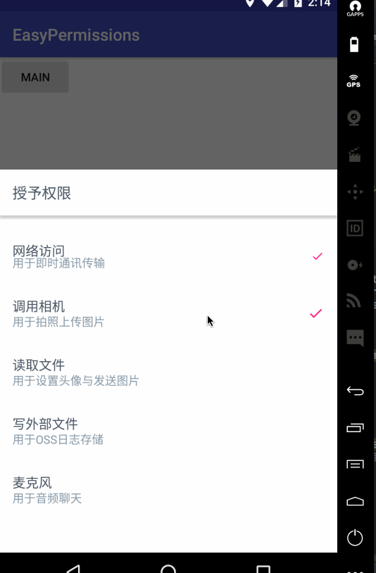

### Android6.0授予权限
#### Android6.0 一般授予权限的步骤为：
* 检查权限
* 如果没有授予权限 则去申请权限
* 权限申请回调，即同意 与 拒绝
* 如果拒绝并且不再提醒 可以跳到设置界面

### 原始的检查权限连google都觉得麻烦，所以他们又封装了[easypermissions](https://github.com/googlesamples/easypermissions)，比较好用，这里就使用这个框架。使用方法也很简单，如下：

* 添加依赖 implementation 'pub.devrel:easypermissions:1.1.1'
* 当前的Activity或者Fragment实现EasyPermissions.PermissionCallbacks接口，
 >	首先需要在Activity实现EasyPermissions.PermissionCallbacks接口，该接口提供了onPermissionsGranted和onPermissionsDenied两个方法，也即权限申请成功和失败的回调方法，而EasyPermissions.PermissionCallbacks又实现了ActivityCompat.OnRequestPermissionsResultCallback，该接口提供了onRequestPermissionsResult方法，相当于EasyPermissions将系统的权限申请结果回调方法又进行了二次封装，同时提供了权限申请成功和失败的回调方法。
 
 ### 需要重写的方法如下：
 
 ```
 		@Override
public void onRequestPermissionsResult(int requestCode, String[] permissions, int[] grantResults) {
    super.onRequestPermissionsResult(requestCode, permissions, grantResults);
    // 调用EasyPermissions的onRequestPermissionsResult方法，参数和系统方法保持一致，然后就不要关心具体的权限申请代码了
    EasyPermissions.onRequestPermissionsResult(requestCode, permissions, grantResults, this);
}
@Override
public void onPermissionsGranted(int requestCode, List<String> list) {
    // 此处表示权限申请已经成功，可以使用该权限完成app的相应的操作了
    // ...
}
@Override
public void onPermissionsDenied(int requestCode, List<String> list) {
    // 此处表示权限申请被用户拒绝了，此处可以通过弹框等方式展示申请该权限的原因，以使用户允许使用该权限
    // 如果权限有没有申请成功的权限存在，则弹出弹出框，用户点击后去到设置界面自己打开权限
if (EasyPermissions.somePermissionPermanentlyDenied(this, perms)) {
    new AppSettingsDialog
            .Builder(this)
            .build()
            .show();
}
} 
```

* 检查权限，比如调用相机

```
/**
 * 获取是否有相机权限
 *
 * @param context 上下文
 * @return True则有
 */
private static boolean haveCameraPerm(Context context) {
    // 准备需要检查的读取权限
    String[] perms = new String[]{
            Manifest.permission.CAMERA
    };
    return EasyPermissions.hasPermissions(context, perms);
}
```

> 先检查有没有这个权限，有的话，直接执行takePhoto()即可，如果没有则调用	requestPerm()去请求权限
boolean hasPermissions = EasyPermissions.hasPermissions(this, perms);
if (hasPermissions) 	takePhoto();
if (！hasPermissions) 	requestPerm();
接下来 看看requestPerm()方法的实现：

```
/**
 * 申请权限的方法
 */
@AfterPermissionGranted(RC)
private void requestPerm() {
    String[] perms = new String[]{
                      Manifest.permission.CAMERA
    };

    if (EasyPermissions.hasPermissions(this, perms)) {
        // 已经授予权限了
        takePhoto();
        
    } else {
        EasyPermissions.requestPermissions(this, "授予权限",
                RC, perms);
    }
}
```


> 这样其实就行了，但是如果在使用的地方都去这样申请权限，是不是有点麻烦，所以不妨在launchActivity界面统一申请所有危险权限，如果用户同意了则进入主界面，否则就退出不给使用
效果如下：



> 其实就是讲我们需要的权限以列表的形式展示出来，让用户知道这些权限是干嘛的，如果用户全部授权了则可进入首页。主要是利用了design包下的BottomSheetDialogFragment。具体代码实现如下：

```
package me.sunlight.easypermissions.assist;


import android.Manifest;
import android.app.Dialog;
import android.content.Context;
import android.content.DialogInterface;
import android.os.Bundle;
import android.support.annotation.NonNull;
import android.support.design.widget.BottomSheetDialog;
import android.support.design.widget.BottomSheetDialogFragment;
import android.support.v4.app.FragmentManager;
import android.view.LayoutInflater;
import android.view.View;
import android.view.ViewGroup;
import android.view.Window;
import android.widget.Toast;

import java.util.List;

import me.sunligh.easypermissions.R;
import me.sunlight.easypermissions.UiTool;
import pub.devrel.easypermissions.AfterPermissionGranted;
import pub.devrel.easypermissions.AppSettingsDialog;
import pub.devrel.easypermissions.EasyPermissions;


/**
 * 权限申请弹出框
 */
public class PermissionsFragment extends BottomSheetDialogFragment
        implements EasyPermissions.PermissionCallbacks {
    // 权限回调的标示
    private static final int RC = 0x0100;

    public PermissionsFragment() {
        // Required empty public constructor
    }

    @NonNull
    @Override
    public Dialog onCreateDialog(Bundle savedInstanceState) {
        // 复用即可
        return new PermissionsFragment.TransStatusBottomSheetDialog(getContext());
    }


    @Override
    public View onCreateView(LayoutInflater inflater, ViewGroup container,
                             Bundle savedInstanceState) {
        // 获取布局中的控件
        View root = inflater.inflate(R.layout.fragment_permissions, container, false);

        // 找到按钮
        root.findViewById(R.id.btn_submit)
                .setOnClickListener(v -> {
                    // 点击时进行申请权限
                    requestPerm();
                });

        return root;
    }

    @Override
    public void onResume() {
        super.onResume();
        // 界面显示的时候进行刷新
        refreshState(getView());
    }

    /**
     * 刷新我们的布局中的图片的状态
     *
     * @param root 跟布局
     */
    private void refreshState(View root) {
        if (root == null)
            return;

        Context context = getContext();

        root.findViewById(R.id.im_state_permission_network)
                .setVisibility(haveNetworkPerm(context) ? View.VISIBLE : View.GONE);

        root.findViewById(R.id.im_state_permission_takePhoto)
                .setVisibility(haveNetworkPerm(context) ? View.VISIBLE : View.GONE);


        root.findViewById(R.id.im_state_permission_read)
                .setVisibility(haveReadPerm(context) ? View.VISIBLE : View.GONE);

        root.findViewById(R.id.im_state_permission_write)
                .setVisibility(haveWritePerm(context) ? View.VISIBLE : View.GONE);

        root.findViewById(R.id.im_state_permission_record_audio)
                .setVisibility(haveRecordAudioPerm(context) ? View.VISIBLE : View.GONE);
    }

    /**
     * 获取是否有网络权限
     *
     * @param context 上下文
     * @return True则有
     */
    private static boolean haveNetworkPerm(Context context) {
        // 准备需要检查的网络权限
        String[] perms = new String[]{
                Manifest.permission.INTERNET,
                Manifest.permission.ACCESS_NETWORK_STATE,
                Manifest.permission.ACCESS_WIFI_STATE
        };

        return EasyPermissions.hasPermissions(context, perms);
    }

    /**
     * 获取是否有相机权限
     *
     * @param context 上下文
     * @return True则有
     */
    private static boolean haveCameraPerm(Context context) {
        // 准备需要检查的读取权限
        String[] perms = new String[]{
                Manifest.permission.CAMERA
        };

        return EasyPermissions.hasPermissions(context, perms);
    }

    /**
     * 获取是否有外部存储读取权限
     *
     * @param context 上下文
     * @return True则有
     */
    private static boolean haveReadPerm(Context context) {
        // 准备需要检查的读取权限
        String[] perms = new String[]{
                Manifest.permission.READ_EXTERNAL_STORAGE
        };

        return EasyPermissions.hasPermissions(context, perms);
    }

    /**
     * 获取是否有外部存储写入权限
     *
     * @param context 上下文
     * @return True则有
     */
    private static boolean haveWritePerm(Context context) {
        // 准备需要检查的写入权限
        String[] perms = new String[]{
                Manifest.permission.WRITE_EXTERNAL_STORAGE
        };

        return EasyPermissions.hasPermissions(context, perms);
    }

    /**
     * 获取是否录音权限
     *
     * @param context 上下文
     * @return True则有
     */
    private static boolean haveRecordAudioPerm(Context context) {
        // 准备需要检查的录音权限
        String[] perms = new String[]{
                Manifest.permission.RECORD_AUDIO
        };

        return EasyPermissions.hasPermissions(context, perms);
    }


    // 私有的show方法
    private static void show(FragmentManager manager) {
        // 调用BottomSheetDialogFragment以及准备好的显示方法
        new PermissionsFragment()
                .show(manager, PermissionsFragment.class.getName());
    }


    /**
     * 检查是否具有所有的权限
     *
     * @param context Context
     * @param manager FragmentManager
     * @return 是否有权限
     */
    public static boolean haveAll(Context context, FragmentManager manager) {
        // 检查是否具有所有的权限
        boolean haveAll = haveNetworkPerm(context)
                && haveCameraPerm(context)
                && haveReadPerm(context)
                && haveWritePerm(context)
                && haveRecordAudioPerm(context);

        // 如果没有则显示当前申请权限的界面
        if (!haveAll) {
            show(manager);
        }

        return haveAll;
    }


    /**
     * 申请权限的方法
     */
    @AfterPermissionGranted(RC)
    private void requestPerm() {
        String[] perms = new String[]{
                Manifest.permission.INTERNET,
                Manifest.permission.ACCESS_NETWORK_STATE,
                Manifest.permission.ACCESS_WIFI_STATE,
                Manifest.permission.CAMERA,
                Manifest.permission.READ_EXTERNAL_STORAGE,
                Manifest.permission.WRITE_EXTERNAL_STORAGE,
                Manifest.permission.RECORD_AUDIO
        };

        if (EasyPermissions.hasPermissions(getContext(), perms)) {
            Toast.makeText(getContext(), "授权成功", Toast.LENGTH_SHORT).show();
            // Fragment 中调用getView得到跟布局，前提是在onCreateView方法之后
            refreshState(getView());
        } else {
            EasyPermissions.requestPermissions(this, "授予权限",
                    RC, perms);
        }
    }


    @Override
    public void onPermissionsGranted(int requestCode, List<String> perms) {

    }

    @Override
    public void onPermissionsDenied(int requestCode, List<String> perms) {
        // 如果权限有没有申请成功的权限存在，则弹出弹出框，用户点击后去到设置界面自己打开权限
        if (EasyPermissions.somePermissionPermanentlyDenied(this, perms)) {
            new AppSettingsDialog
                    .Builder(this)
                    .build()
                    .show();
        }
    }

    /**
     * 权限申请的时候回调的方法，在这个方法中把对应的权限申请状态交给EasyPermissions框架
     */
    @Override
    public void onRequestPermissionsResult(int requestCode, @NonNull String[] permissions, @NonNull int[] grantResults) {
        super.onRequestPermissionsResult(requestCode, permissions, grantResults);
        // 传递对应的参数，并且告知接收权限的处理者是我自己
        EasyPermissions.onRequestPermissionsResult(requestCode, permissions, grantResults, this);
    }


    /**
     * 为了解决顶部状态栏变黑而写的TransStatusBottomSheetDialog
     */
    public static class TransStatusBottomSheetDialog extends BottomSheetDialog {

        public TransStatusBottomSheetDialog(@NonNull Context context) {
            super(context);
        }

        public TransStatusBottomSheetDialog(@NonNull Context context, int theme) {
            super(context, theme);
        }

        protected TransStatusBottomSheetDialog(@NonNull Context context, boolean cancelable, DialogInterface.OnCancelListener cancelListener) {
            super(context, cancelable, cancelListener);
        }

        @Override
        protected void onCreate(Bundle savedInstanceState) {
            super.onCreate(savedInstanceState);

            final Window window = getWindow();
            if (window == null)
                return;


            // 得到屏幕高度
            int screenHeight = UiTool.getScreenHeight(getOwnerActivity());
            // 得到状态栏的高度
            int statusHeight = UiTool.getStatusBarHeight(getOwnerActivity());

            // 计算dialog的高度并设置
            int dialogHeight = screenHeight - statusHeight;
            window.setLayout(ViewGroup.LayoutParams.MATCH_PARENT,
                    dialogHeight <= 0 ? ViewGroup.LayoutParams.MATCH_PARENT : dialogHeight);

        }
    }
}


``` 

>在launcnActivity调用即可：

```
@Override
protected void onResume() {
    super.onResume();
    boolean haveAll = PermissionsFragment.haveAll(this, getSupportFragmentManager());

    if (haveAll){
        HomeActivity.runActivity(this);
        finish();
    }

}

```


	


